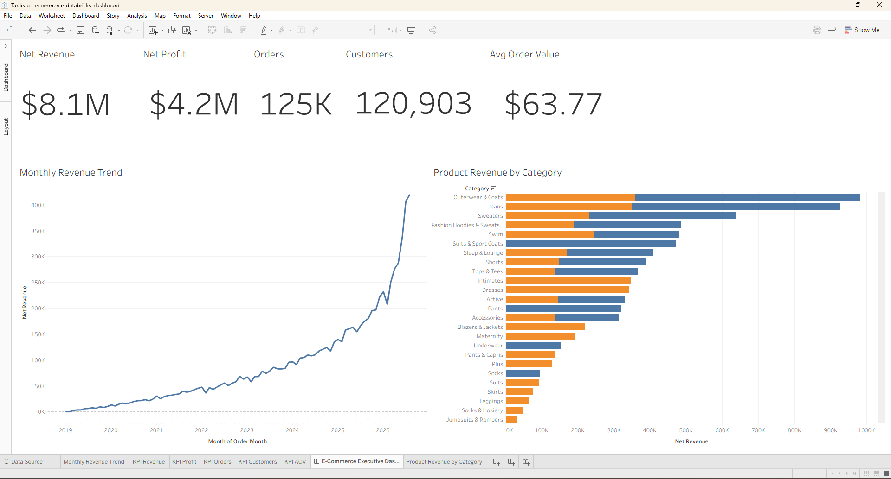

# Tableau Workspace

This folder stores Tableau connection notes, dashboard plans, screenshots, and workbook packaging notes.

The first Tableau dashboard should connect to Databricks Gold tables/views through a Databricks SQL Warehouse.

## Dashboard Evidence

The first Tableau executive dashboard has been built against Databricks Gold views.

Current dashboard components:

- KPI row for net revenue, net profit, orders, customers, and average order value.
- Monthly net revenue trend from `workspace.eacc_ecommerce_gold.vw_executive_monthly`.
- Product revenue by category from `workspace.eacc_ecommerce_gold.vw_product_performance`.
